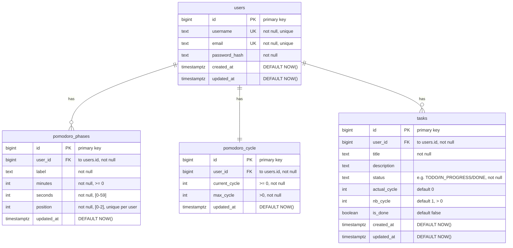

<h1 align="center">PomodoroWeb</h1>

## Stack Techno

Le projet doit être reproductible. Pour cela, il sera dockerisé.

### Base de données

- PostgreSQL 17.6 (Base de Données)
- Flyway 11.14 (Migration de la base de données)

#### ERD

### BackEnd

- Node 22.20 (Runtime)
- Express (Routing)
- bcrypt (Hachage)
- JWT (token de session)
- *NC* (Système de mailing automatique)

### Frontend

- React (SPA)
- React Router (Routing)
